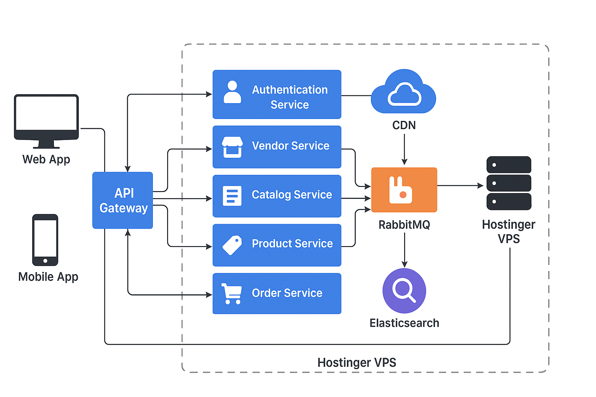

# 🧾 Requirement Analysis Document

**Project Title:** Multivendor E-commerce Platform (Microservices Architecture)  
**Prepared by:** [Mahadiul Hasan]  
**Version:** 1.0  
**Date:** October 2025

---

## 📚 Table of Contents

1. [Project Overview](#1-project-overview)
2. [Objectives](#2-objectives)
3. [Stakeholders](#3-stakeholders)
4. [Functional Requirements](#4-functional-requirements)
5. [Non-Functional Requirements](#5-non-functional-requirements)
6. [System Architecture Overview](#6-system-architecture-overview)
7. [High-Level Service List](#7-high-level-service-list)
8. [Integration Flow Example](#8-integration-flow-example-order-placement)
9. [External Integrations](#9-external-integrations)
10. [Hosting & Deployment](#10-hosting--deployment)
11. [Security Considerations](#11-security-considerations)
12. [Assumptions & Dependencies](#12-assumptions--dependencies)
13. [Risks & Mitigation](#13-risks--mitigation)
14. [Success Metrics](#14-success-metrics)
15. [Deliverables](#15-deliverables)
16. [Version History](#16-version-history)

---

## 1. Project Overview

The goal of this project is to build a **scalable multivendor e-commerce platform** where vendors can register, list their products, manage orders, and receive payments — while customers can browse, search, purchase, and track products seamlessly.

The system will use a **microservices architecture**, ensuring scalability, fault isolation, and maintainability. Each service owns its own database and communicates through REST APIs and a message broker.

**Tech Stack Overview:**

-   **Backend:** Node.js (Express/NestJS) for all services, Go for Catalog Service
-   **Frontend:** Next.js (Customer Storefront), React.js (Vendor & Admin Dashboards)
-   **Database:** PostgreSQL + MongoDB
-   **Cache:** Redis
-   **Message Broker:** RabbitMQ
-   **Search:** Elasticsearch
-   **Media CDN:** Cloudinary
-   **Hosting:** Hostinger VPS

---

## 2. Objectives

-   Enable **multi-vendor selling** with separate shop management.
-   Provide **secure, fast, and intuitive shopping** for customers.
-   Use **microservices** for modular, scalable development.
-   Deliver **real-time updates** using message queues.
-   Provide **optimized image delivery** via Cloudinary CDN.
-   Support **powerful product search** with Elasticsearch.
-   Maintain **high uptime and observability** via logging, metrics, and tracing.

---

## 3. Stakeholders

| Role                       | Responsibility                                 |
| -------------------------- | ---------------------------------------------- |
| **Client / Product Owner** | Define features and validate deliverables      |
| **Team Lead / Architect**  | System design, microservice boundaries, review |
| **Backend Developers**     | Implement Node.js & Go microservices           |
| **Frontend Developers**    | Build Next.js & React.js UIs                   |
| **DevOps Engineer**        | Handle CI/CD, Docker, VPS, monitoring          |
| **QA Engineer**            | Automation, integration, and load testing      |
| **UI/UX Designer**         | Design responsive and intuitive interfaces     |
| **Security Engineer**      | Audit security, handle data protection         |

---

## 4. Functional Requirements

### 4.1 Authentication & Authorization

-   Role-based login (Customer, Vendor, Admin)
-   Email verification, password reset
-   JWT-based authentication
-   OAuth2/Social login (optional)
-   Token refresh mechanism

### 4.2 Vendor Management

-   Vendor registration with KYC verification
-   Shop profile creation (name, logo, banner)
-   Manage listed products, orders, payouts
-   Sales report and analytics dashboard

### 4.3 Product & Catalog Management

-   Product CRUD with attributes, variations
-   Bulk upload (CSV/Excel)
-   Category, subcategory hierarchy
-   Product media via Cloudinary
-   Go-based **Catalog Service** for high-performance listing and filtering
-   Inventory tracking per variant

### 4.4 Search & Discovery

-   Elasticsearch-powered search
-   Filters (category, price, rating, brand)
-   Sorting (relevance, popularity)
-   Caching search results in Redis

### 4.5 Cart & Checkout

-   Add/update/remove cart items
-   Save cart for logged-in users
-   Guest checkout option
-   Apply coupons and discounts
-   Checkout flow with shipping and payment

### 4.6 Order Management

-   Place and track orders
-   Order status: Pending → Paid → Shipped → Delivered → Completed
-   Returns and cancellations
-   Order notifications to vendor & customer

### 4.7 Payment & Payouts

-   Secure payment integration (Stripe / SSLCommerz)
-   Platform commission and vendor payout system
-   Refund and chargeback handling
-   Payout scheduling and reconciliation

### 4.8 Notifications

-   Email/SMS/push for key events
-   Centralized notification templates
-   Async queue via RabbitMQ

### 4.9 Reviews & Ratings

-   Verified customer reviews
-   Star rating aggregation
-   Review moderation (admin)

### 4.10 Admin Dashboard

-   Manage users, vendors, orders, payments
-   Approve vendor accounts
-   Product moderation
-   View logs, reports, and system status

### 4.11 Analytics & Reports

-   Sales and order analytics (vendor & admin)
-   Inventory and performance insights
-   Export reports in CSV/XLS formats

---

## 5. Non-Functional Requirements

| Category            | Description                                  |
| ------------------- | -------------------------------------------- |
| **Performance**     | ≤300ms average response time                 |
| **Scalability**     | Services scale independently                 |
| **Security**        | JWT auth, HTTPS, data encryption             |
| **Availability**    | 99.5% uptime                                 |
| **Maintainability** | Modular codebase with proper documentation   |
| **Observability**   | Centralized logs, metrics, tracing           |
| **Compliance**      | GDPR and PCI DSS                             |
| **Extensibility**   | Easy to add new services without refactoring |

---

## 6. System Architecture Overview

### 🧩 Architecture Pattern

**Microservices-based architecture** with a shared message bus and separate databases per service.

### 🧠 Core Components

-   **Frontend:** Next.js (Storefront), React (Vendor/Admin)
-   **Backend Services:** Node.js (all), Go (Catalog)
-   **Search Engine:** Elasticsearch
-   **Message Broker:** RabbitMQ
-   **Cache Layer:** Redis
-   **Media CDN:** Cloudinary
-   **Databases:** PostgreSQL, MongoDB
-   **Deployment:** Docker containers on Hostinger VPS
-   **Monitoring:** Prometheus + Grafana
-   **Logging:** ELK stack (Elasticsearch, Logstash, Kibana)
-   **Error Tracking:** Sentry

---

## 7. High-Level Service List

| Service                  | Responsibility                            | Tech    | Database         |
| ------------------------ | ----------------------------------------- | ------- | ---------------- |
| **Auth Service**         | User management, JWT, RBAC                | Node.js | PostgreSQL       |
| **Vendor Service**       | Vendor profile, KYC, payouts              | Node.js | PostgreSQL       |
| **Catalog Service**      | Product catalog, listing, filtering       | Go      | MongoDB          |
| **Product Service**      | Product CRUD, variants, Cloudinary upload | Node.js | MongoDB          |
| **Inventory Service**    | Stock tracking, reservation               | Node.js | PostgreSQL       |
| **Order Service**        | Order placement, lifecycle, history       | Node.js | PostgreSQL       |
| **Payment Service**      | Integrate PSPs, handle refunds            | Node.js | PostgreSQL       |
| **Cart Service**         | Cart CRUD, persistence, Redis cache       | Node.js | Redis/PostgreSQL |
| **Search Service**       | Elasticsearch indexing, search API        | Node.js | Elasticsearch    |
| **Notification Service** | Email/SMS/push queue handler              | Node.js | PostgreSQL       |
| **Admin Service**        | Manage system entities                    | Node.js | PostgreSQL       |

---

## 8. Integration Flow Example: Order Placement

1. **Customer** places an order via the frontend.
2. **Order Service** validates cart, reserves inventory.
3. Publishes `OrderCreated` event to **RabbitMQ**.
4. **Payment Service** listens → processes payment → emits `PaymentSuccess`.
5. **Inventory Service** confirms stock deduction.
6. **Notification Service** sends emails to vendor & customer.
7. **Vendor Dashboard** reflects new order in real time.

---

## 9. External Integrations

| Service                 | Purpose                                  |
| ----------------------- | ---------------------------------------- |
| **Cloudinary**          | Product image CDN and media optimization |
| **Stripe / SSLCommerz** | Payment gateway                          |
| **SendGrid / Mailgun**  | Email notifications                      |
| **Elasticsearch**       | Product search and discovery             |
| **RabbitMQ**            | Event-driven communication               |
| **Redis**               | Caching, rate limiting, session storage  |

---

## 10. Hosting & Deployment

-   **Platform:** Hostinger VPS (Ubuntu 22.04)
-   **Containerization:** Docker + Docker Compose
-   **Reverse Proxy:** Nginx
-   **CI/CD:** GitHub Actions → SSH deploy to VPS
-   **SSL:** Let’s Encrypt certificates
-   **Monitoring:** Prometheus + Grafana
-   **Domain & DNS:** Managed via Cloudflare (optional)

---

## 11. Security Considerations

-   Enforce HTTPS (TLS)
-   Passwords hashed using bcrypt
-   Input validation (server & client)
-   Role-based access control
-   Rate limiting via Redis
-   API Gateway request validation
-   Audit logging for sensitive actions
-   Secrets stored securely in environment variables
-   Regular security scans (Snyk/Dependabot)

---

## 12. Assumptions & Dependencies

-   Vendors provide valid verification documents.
-   Payments handled via trusted gateways.
-   VPS has sufficient CPU, RAM, and storage resources.
-   RabbitMQ, Redis, and PostgreSQL containers run in isolated networks.

---

## 13. Risks & Mitigation

| Risk                            | Impact | Mitigation                            |
| ------------------------------- | ------ | ------------------------------------- |
| Service failure due to overload | High   | Autoscaling & Redis caching           |
| Payment gateway downtime        | High   | Retry + queue fallback                |
| Image upload failure            | Medium | Retry + Cloudinary webhook            |
| Search lag                      | Medium | Async Elasticsearch sync              |
| Data inconsistency              | High   | Event sourcing + idempotency keys     |
| VPS downtime                    | High   | Automated backups & monitoring alerts |

---

## 14. Success Metrics

-   API response time < 300ms
-   99.5% uptime
-   <1% payment failure rate
-   Vendor onboarding < 10 mins
-   <0.1% error log ratio to total requests
-   Search latency < 150ms

---

## 15. Deliverables

-   [x] Requirement Analysis Document
-   [ ] Architecture Diagram
-   [ ] Database Schema
-   [ ] API Specification (Swagger/OpenAPI)
-   [ ] Event Schema (RabbitMQ topics)
-   [ ] CI/CD Configuration
-   [ ] Monitoring Dashboard Setup
-   [ ] MVP Deployment Plan

---

## 16. Version History

| Version | Date       | Description                        | Author    |
| ------- | ---------- | ---------------------------------- | --------- |
| 1.0     | 2025-10-04 | Initial requirement analysis draft | Team Lead |

---
